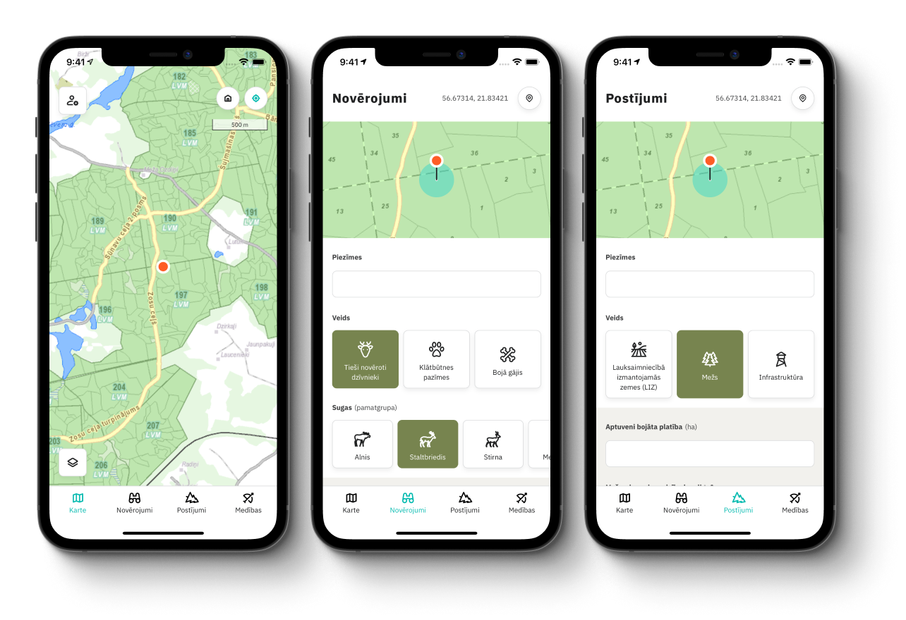

    

# Mednis

A mobile application (iOS and Android) for collecting data compatible with the [State Forest Registers](https://www.vmd.gov.lv/valsts-meza-dienests) for recording animals, evidence of its presence, hunting and damage. The application is designed to promote the optimal use, conservation and regulation of forestry resources, while reducing the risk of damage and loss in the forestry and agricultural sectors, as well as reducing the administrative burden of hunting.

## Contributing

See `CONTRIBUTING.md` for ways to get started.

## License

MIT
